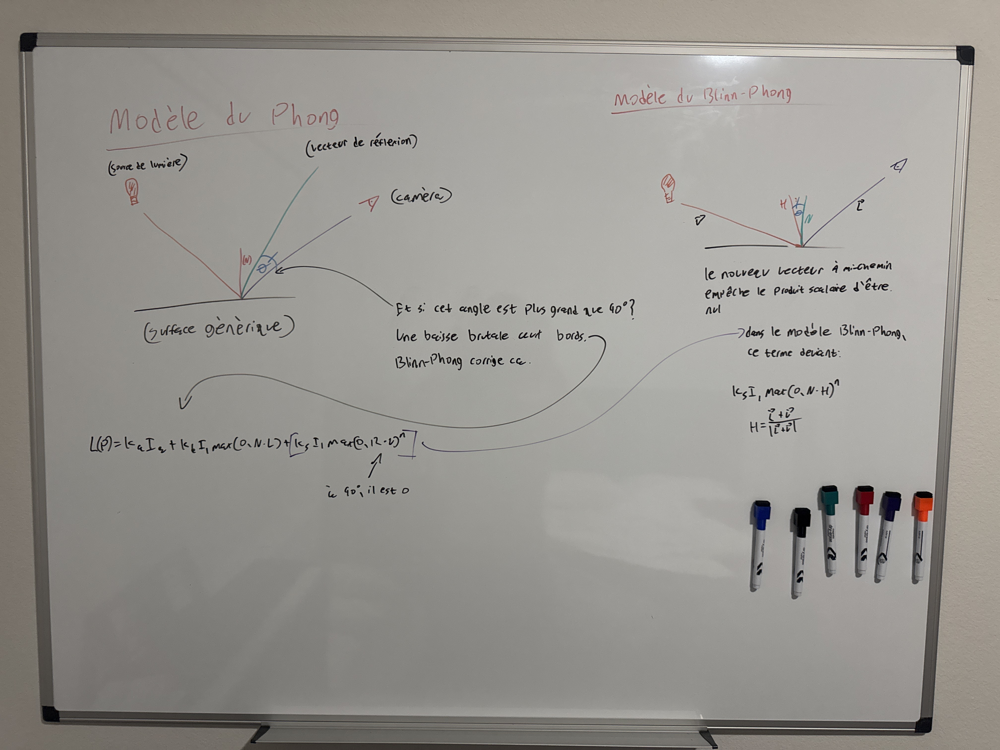
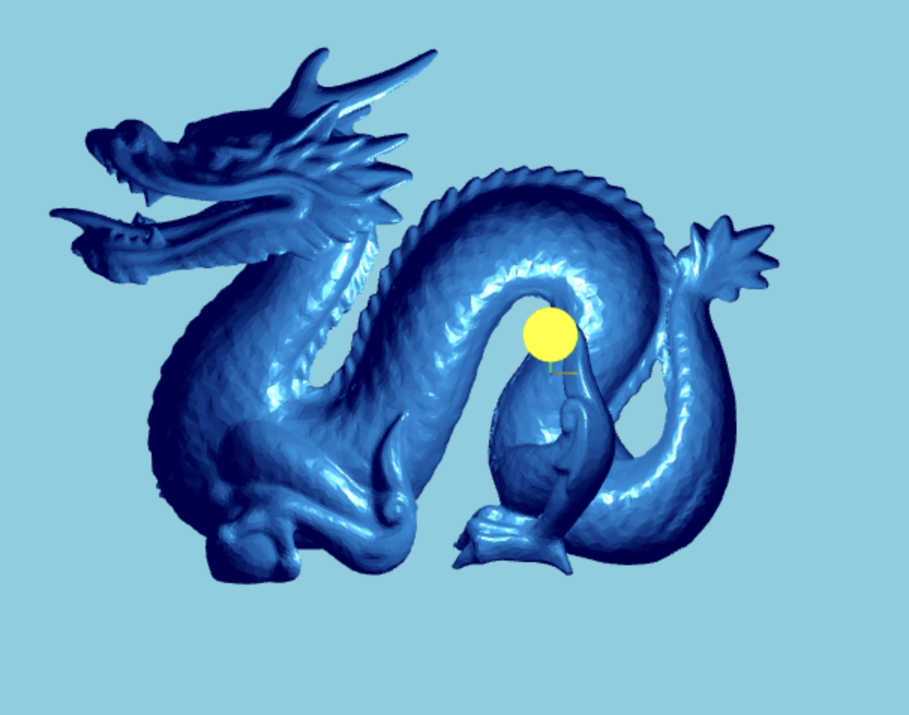
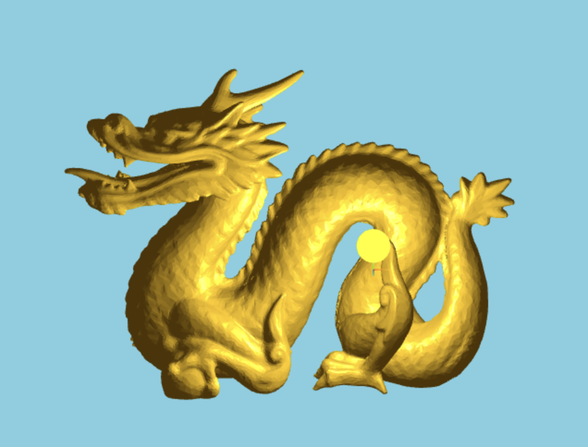
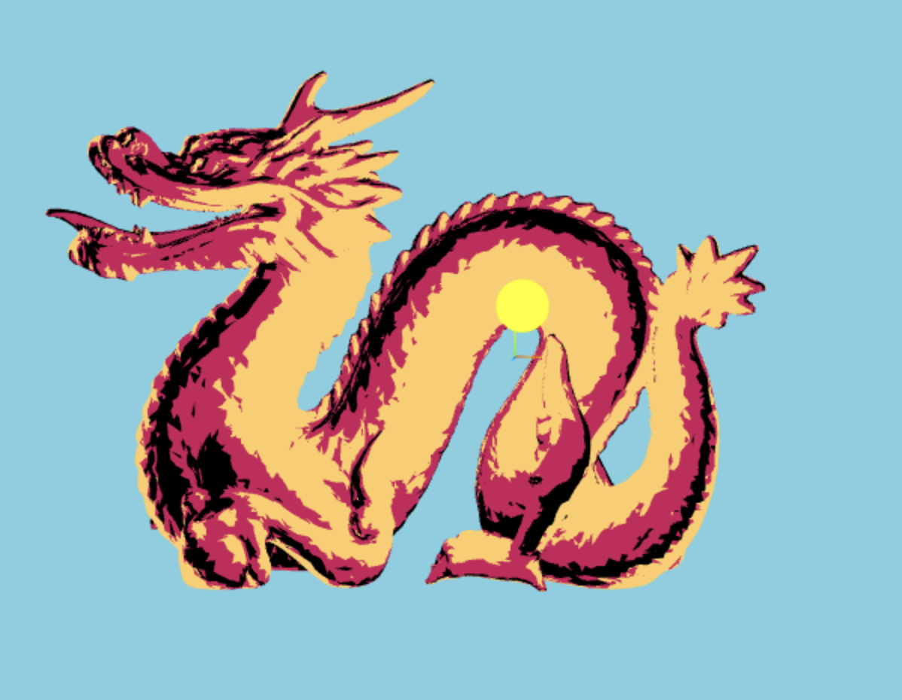
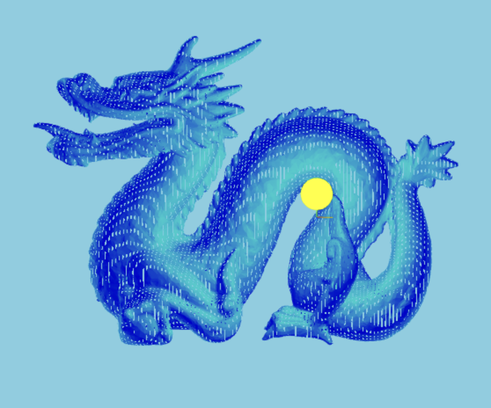
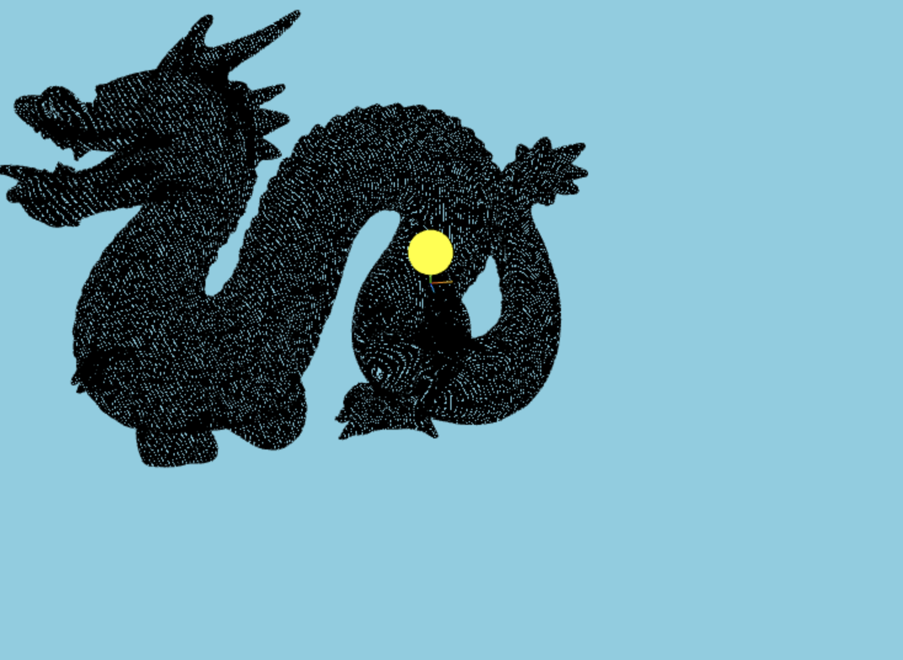
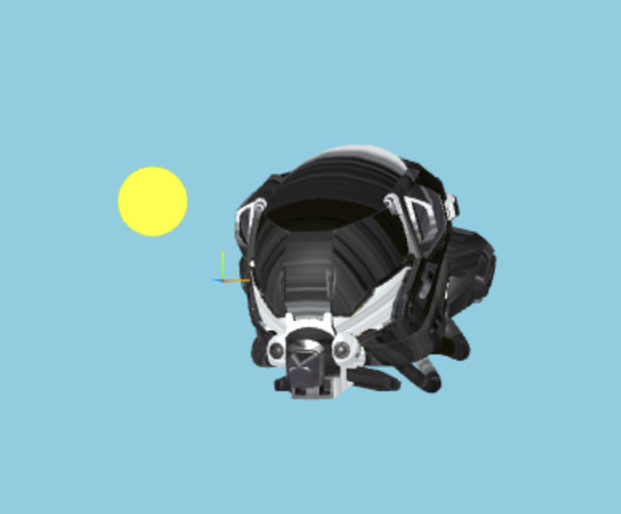
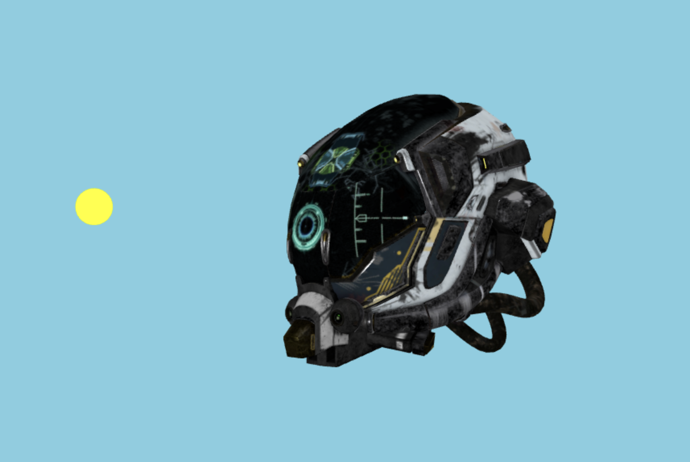

# Assignment 4
 
See [A4.pdf](A4.pdf) for the assignment specifications.

## Controls 
- WASD to move the light ball around on the xz plane
- QE to move the light ball up and down
- Click and drag to move camera
- 1,2,3,4 to switch shaders

Part 1a:

This was simple enough to do since all it really entailed was taking the Blinn-Phong equation and translating it into code. I drew up the differences between Phong and BP on a whiteboard just to help myself understand it better

But this was not strictly necessary. (Apologies for the french, I'm using my notes as a way to practice)

The fragment shader just needed to make sure the normals are facing the right way and that the pixels of the model are being worked with in world space instead of local. 

"""
    // we take each vertex and 1) put it in terms of world coordinates instead of local to the dragon,
    // 2) get the normal and put it into world coordinates as well, and
    // 3) pass the view position along in world space so we can do math on it in the fragment
    worldPosition = vec3(modelMatrix * vec4(position, 1.0));
    interpolatedNormal = normalize(mat3(modelMatrix) * normal); // 3x3 to avoid translation and scaling, we only want the model matrix to rotate the normal to face the correct direction
    viewPosition = worldPosition;
"""

The vertex shader was more or less a 1:1 translation of math to code wrt Blinn-Phong. Look at the equation and make sure everything is accounted for and ordered correctly in the code so as to accurately represent the equation, of course normalizing our vectors

"""
    // this is all just a translation of the equation 
    // I = (Ka * Ia) + (Kd * Il * max(0, N · L)) + (Ks * Il * max(0, N · H)^Ns)
    // into code

    // "https://garykeen27.wixsite.com/portfolio/blinn-phong-shading" was used to assist in understanding

        
    vec3 lightDir = normalize(spherePosition - worldPosition);   
    vec3 viewDir = normalize(-viewPosition);                     
    vec3 halfwayVector = normalize(lightDir + viewDir);                             

    vec3 ambient  = kAmbient  * ambientColor;
    vec3 diffuse  = kDiffuse  * max(dot(interpolatedNormal, lightDir), 0.0) * diffuseColor;
    vec3 specular = kSpecular * pow(max(dot(interpolatedNormal, halfwayVector), 0.0), shininess) * specularColor;

"""

As a sidenote I went into A4.js and played with the color values slightly to more accurately match the colors in the assignment instructions, as the provided code came out very blue 

Part 1b:

So I don't like how this turned out and it doesn't look as nice as the demo picture, but it does establish a black outline that is not affected by light and it does interpolate between two colors based on light intensity so it satisfies the requirements of this part. With more time I would really like to make this work better.

Vertex shader was much the same story as 1a, just with the addition of computing this fresnel term that was used for determining where the outine should go

"""
    // same as in part A1, just taking the local coordiates and transforming them to world coordinates, as well as figuring out
    // what the light direction is in world coordinates. Don't think we need it but rather have it
    vec3 worldPosition = vec3(modelMatrix * vec4(position, 1.0));
    interpolatedNormal = normalize(mat3(modelMatrix) * normal);
    lightDirection = normalize(spherePosition - worldPosition);

    vec3 viewDir = normalize(-worldPosition);

    // for figuring out the border for the black outline
    fresnel = dot(interpolatedNormal, viewDir);
"""

Fragment shader was a matter of doing my best to follow what the lengthy guide comment advised to do. 
Calculate the light intensity via dot product, set up a step function to interpolate between the two colors, and 
determine where the fresnel cutoff for the black border should go

"""
    float lightIntensity = abs(dot(interpolatedNormal, lightDirection));

    float quantized = step(0.5, lightIntensity);

    vec3 toonColorFinal = mix(toonColor2, toonColor, quantized);

    // outline size can be governed by adjusting this threshold value
    if (fresnel < .2)
        gl_FragColor = vec4(outlineColor, 1.0);   // outline (black)
    else
        gl_FragColor = vec4(toonColorFinal, 1.0); // toon-shaded surface
"""

I would note that I ended up removing the attribute of viewPosition as I did not end up using it. This is very likely why I have had trouble making it look it nice as that was probably there for a reason. 

Part 1c:

This one is cool, I like it. Turned out really well. Setting up the vertex shader was simple enough (though there's a trap in there if you're not careful), and the fragment was fun to figure out how to get scrolling dots on screen. 

Vertex shader was keeping to the theme of this assignment for the most part, normalize the normals and rotate them correctly, calculate the light direction vertex, etc. But to make the dots render work we actually do not want to convert the vertex position into world coordinates. We want the dot pattern to stay confined to the dragon and we're not concerned with vertex dependent lighting calculations so we actually want the vertices to stay local. That'll trip you up if you're not careful

"""
    // TODO:
    // HINT: We need vertexPosition in local object frame, lightDirection in VCS.
    // And don't forget to transform the normal to an appropriate frame!

    interpolatedNormal = normalize(mat3(modelMatrix) * normal);

    //defaults to local coordinates, no need to manipulate
    vertexPosition = position; 
    lightDirection = normalize(spherePosition - vec3(modelMatrix * vec4(position, 1.0)));
"""

Fragment shader is where the fun is. Calculating the light intensity was not something new as we've done it twice now and the process is much the same here. Creating a dynamic blend of a base color was fun though, it's interesting that it's basically setting the color at a given frame according to the oscillation of a sine wave. Of course that isn't the really interesting part, that's the dots. So how do we do this? Well we can use the fact that modulus of 1 essentially bounds a repeating pattern to the range [0,1] forever. So we use this to build a grid with which we can render dots. Set our vertexPosition (that is still local, that's why this works), multiply it by some scalar that governs the relative size of the box we have to play in, and add to that some varying vector governed chiefly by the ticks uniform that will govern what direction the grid "flows" so to speak. We want to know the center of this mathematical object we've created so we subtract by .5 to make sure we're there. We then want to know how far away a given vertex is from the center of our object so we set up an equation that subtracts distances to find that. Finally, if the vertex is some distance away from the center, we tell GLSL that we don't want to render it. All of this in conjunction gives us the visual of a dragon made up of a field of infinitely repeating and traveling dots. 

TL:DR, we build a grid of "dot space" and if our vertices at a given point in time are not "dot candidates" we don't render those vertices. Repeated ad infinitum and we get our effect.

"""
    // TODO:
    // HINT: First, as you've already done in the Toon fragment shader, compute the light
    // intensity of the current fragment by determining the cosine angle between the surface
    // normal and the light vector. Next, pick any two colors, blend them based on light
    // intensity to give the 3D model some color and depth. Also make the color change wrt tick.
    // Next, implement rolling dots using the mod function, tick and discard.

    float lightIntensity = abs(dot(interpolatedNormal, lightDirection));

    //these colors are completely arbitrary, can be changed to anything
    vec3 baseColor = mix(vec3(0.0, 0.0, 1.0), vec3(0.0, 1.0, 1.0), lightIntensity) * sin(ticks * 0.9);

    //dots (this block is explained in depth in the README)
    vec3 dotGrid = mod(vertexPosition * 11.0 + vec3(ticks * 0.5, 0.0, 0.0), 1.0);
    vec3 centered = dotGrid - 0.5;
    float distance = length(centered.xy);
    if (distance < 0.2) {
        discard;
    }

    // HINT: Set final rendered colour
    gl_FragColor = vec4(baseColor, 1.0);
"""

Part 1d:

So this was somewhat frustrating and I still don't know why. Loading the textures themselvs and getting the helmet on scene was easy, I've been doing basically that as extra credit on all the assignments up to now

"""

    // TODO: Load relevent textures cafeColorMap, cafeNormalMap, cafeOccRoughMetalMap
    // using THREE.TextureLoader

    const albedoMap = new THREE.TextureLoader().load('gltf/Default_albedo.jpg');
    const ambientOcclusionMap = new THREE.TextureLoader().load('gltf/Default_AO.jpg');
    const emissiveMap = new THREE.TextureLoader().load('gltf/Default_emissive.jpg');
    const metalRoughnessMap = new THREE.TextureLoader().load('gltf/Default_metalRoughness.jpg');
    const normalMap = new THREE.TextureLoader().load('gltf/Default_normal.jpg');

    const helmetMaterial = new THREE.MeshStandardMaterial({
  // TODO: pass texture maps to the material. And set material's metalness.
  map: albedoMap,
  aoMap: ambientOcclusionMap,
  emissiveMap: emissiveMap,
  roughnessMap: metalRoughnessMap,
  metalnessMap: metalRoughnessMap,
  normalMap: normalMap,
  metalness: 1,
});

  loadAndPlaceGLB("gltf/DamagedHelmet.gltf", helmetMaterial, function (helmet) {
    helmet.position.set(3.8, 0.4, -1.3);
    helmet.scale.set(5, 5, 5);
    helmet.traverse(obj => {
      if (obj.isMesh && !obj.geometry.attributes.uv2 && obj.geometry.attributes.uv) {
        obj.geometry.setAttribute('uv2', obj.geometry.attributes.uv);
      }
    });
    scene.add(helmet);
  });

"""

But for the life of me I could not figure out how to get the maps to actually render to the helmet. This is as close as I got:

I ended up 1) running out of time and 2) getting frustrated so just for the sake of getting a finished product that matched the reference image I swapped the GLB with a GLFE loader. I am aware this was not the intent of the assignment but I was not going to be able to leave this without those textures displaying in some way shape or form and getting them to load the intended way was becoming somewhat of a lost cause for me.

"""
    if (shader.material == helmetMaterial) {
    const loader = new GLTFLoader().setPath('gltf/');
    loader.load('DamagedHelmet.gltf', function (gltf) {
        const model = gltf.scene;
        model.position.set(3.8, 0.4, -1.3);
        model.scale.set(10,10,10);

    scene.add(model);
  });

"""

